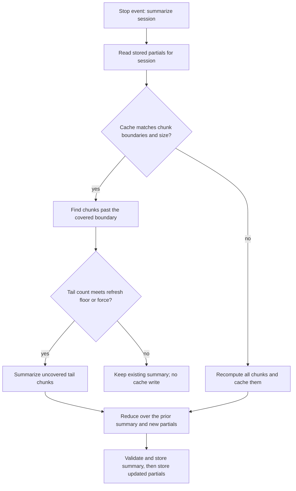
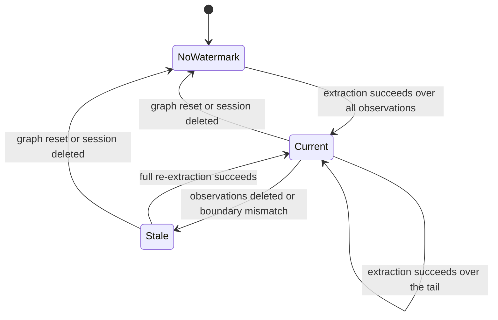

# Incremental Session Summarization and Graph Extraction - Plan

## Goal Capsule

**Objective:** Interactive memory work on a long-running session consumes LLM capacity proportional to the new material added since the last pass, not to the session's total size.
**Means:** Reuse previously computed summarization chunks and watermark graph extraction per session (KTD2, KTD4).
**Authority:** This plan governs implementation mechanism; the Product Contract's requirements govern product behavior.
**Backstop:** The background drain already parks in LLM idle windows; this plan removes the redundant interactive work that backstop was managing around.
**Stop conditions:** Stop and return to planning if a unit's approach would change the stored summary contract, delete user data beyond the derived caches named here, or require a provider/model change.
**Finishing:** The implementer lands the units on a feature branch and opens a PR; no external release step is required.

---

## Product Contract

### Summary

Make session-stop LLM work incremental: summarization reuses prior chunk results and only re-processes new observations, and graph extraction processes only the session tail it has not seen. A configurable freshness floor keeps a session's summary from refreshing on every turn.

### Problem Frame

A session's Stop hook fires on every assistant turn. `mem::summarize` re-chunks and re-summarizes the entire session each time observations have grown, and `event::session::stopped` feeds the whole session to `mem::graph-extract` every turn (src/functions/summarize.ts, src/triggers/events.ts:116-131). Measured on a local single-slot Ollama: a 1000-observation session produced 10 chunk calls per turn, and an interactive 8-token completion measured 25.6s-75.7s while the drain ran versus 0.52s/0.17s when idle. The quadratic cost is tracked upstream as #1131; the per-turn whole-session extraction has no issue and `GRAPH_EXTRACTION_BATCH_SIZE` is dead config (src/config.ts:396). The drain-side contention is already fixed (KTD1); what remains is the redundant work itself.

### Requirements

Summarization:

- R1. A re-summarization of a session reuses prior per-chunk results; only chunks containing observations not yet covered are sent to the LLM.
- R2. A refresh writes a new stored summary only when the uncovered tail reaches a configurable minimum, or when no summary exists; an explicit force recomputes everything.
- R3. The stored summary keeps its current fields and export shape, and is replaced only after a refresh succeeds.

Graph extraction:

- R4. Session-stop extraction processes only observations not yet extracted for that session, in bounded batches.
- R5. A failed or partial extraction leaves its watermark unadvanced so the same range is retried.

Derived state:

- R6. Chunk partials and extraction watermarks are internal derived state: excluded from export/import, cleared when the graph is reset, and removed when their session or observations are deleted.
- R7. Existing stores and hosted providers behave as before with no required configuration; absent derived state degrades to a full recompute.

### Success Criteria

- On a growing session, the number of LLM calls per Stop event stays flat rather than growing with total observation count, verified on the local daemon.
- Summaries produced incrementally parse and validate under the existing schema, with no change to `SessionSummary` or the export payload.
- `npm test` passes with new coverage for reuse, refresh policy, watermark advance, and cleanup.

### Scope Boundaries

#### Deferred to Follow-Up Work

- Consolidation, reflect, and crystallization cost (they run on their own schedule and are gated by `consolidationDue`).
- Viewer surfacing of summary staleness.
- Provider or model changes; hosted-provider concurrency tuning.
- Backfill of sessions that predate this change; the existing graph-build drain already covers graph backfill.

---

## Planning Contract

### Key Technical Decisions

- KTD1. The background graph-build drain parks between batches until the LLM endpoint has been quiet for a configurable window, and returns the last completed cursor instead of holding the HTTP call open (shipped in the preceding fix; the backstop for this work). (session-settled: user-approved — chosen over leaving the drain unthrottled: interactive calls were queueing behind 50-90s background generations).
- KTD2. Chunk partials live in a dedicated KV scope keyed by session, holding the session id, the chunk size used, each chunk's observation-range boundary, the parsed partial result, and the covered count; a boundary mismatch or chunk-size change discards the cache and recomputes (R1, R3). The stored session id is what lets enumeration-based cleanup recover the KV key, because listing a scope returns values without keys. Refreshes fold the previous stored summary together with only the new tail's partials so per-refresh input is bounded by chunk size rather than total chunk count; the fidelity cost of that fold is tracked as a residual risk.
- KTD3. Refresh policy is a minimum-uncovered-observations floor applied on both the chunked and the single-call path, configurable with an environment override; default 10 observations; `0` refreshes every turn while the existing skip for a summary that already covers every observation still applies (R2).
- KTD4. The extraction watermark is a dedicated KV scope keyed by session, holding the session id, a count, and the boundary observation id; it advances per completed batch only when that batch reported no LLM-leg failure, so a heuristic-only success never marks a range extracted (R4, R5). The scope is cleared at the top of the graph-reset path, before its snapshot-only early return.
- KTD5. The session-stop tail is extracted in batches sized by the existing `GRAPH_EXTRACTION_BATCH_SIZE` setting, clamped to at least 1 and aligned with its documented example, under the same wall-clock budget and bounded-failure handling as the graph-build drain so one poison batch cannot stall a stop (R4). Batch-per-prompt extraction cannot see relationships spanning batch boundaries; the batch size is the knob for that completeness-versus-cost tradeoff.
- KTD6. Summarize refresh and watermark advance run under the existing session-keyed lock helper so duplicate Stop events for one session cannot double-run or interleave cache writes (R1, R4).
- KTD7. New derived scopes are deliberately absent from the export collection list, matching how embeddings are treated; an import never carry them (R6, R7).

### High-Level Technical Design

Incremental summarization on a Stop event:

Extraction watermark lifecycle:

Refresh decision table:

| State | Force | Tail count vs floor | Result |
|---|---|---|---|
| No summary, partials absent | any | any | Full compute, store summary and partials |
| Summary current, partials valid | no | below floor | No LLM call; partials unchanged |
| Summary current, partials valid | no | at or above floor | Tail chunks plus reduce over the prior summary and new partials |
| Summary current, partials valid | yes | any | Recompute all chunks plus reduce |
| Summary current, single-call session | no | below floor | No LLM call; partials unchanged |
| Summary current, single-call session | no | at or above floor | Tail summarized as one partial, folded into the prior summary |
| Partial boundary mismatch | no | any | Discard partials, full compute |
| Session transitions to completed | any | any | Refresh regardless of the floor |

### Implementation Constraints

- `src/state/schema.ts` and `src/types.ts` must be updated together for any new KV scope (project convention).
- No new required configuration; new settings default to current behavior or a safe improvement.
- The summary output contract, including the export payload, is frozen by R3.

### Sequencing

U1 establishes the partial cache; U2 builds the refresh policy on it; U3 is independent and can proceed in parallel; U4 closes lifecycle gaps after U1 and U3.

---

## Implementation Units

### U1. Chunk partial cache for incremental summarization

**Goal:** Re-summarizing a session reuses previously computed chunk partials.
**Requirements:** R1, R3, R7
**Dependencies:** none
**Files:** `src/state/schema.ts`, `src/types.ts`, `src/functions/summarize.ts`, `test/summarize-incremental.test.ts`
**Approach:**
- Add a derived KV scope for per-session partials and a matching type carrying the session id, chunk size, per-chunk range boundary and partial result, covered count, and timestamp.
- Load and validate the cache on both paths; reuse valid partials and send only chunks beyond the covered boundary to the LLM. For sessions at or below chunk size, persist the first result as a single partial and summarize only the uncovered tail on later refreshes.
- Fold the previously stored summary together with the new tail partials in the reduce step so per-refresh input is bounded by chunk size rather than total chunk count.
- Wrap the refresh in the session-keyed lock helper so duplicate Stop events cannot interleave cache writes.
- Update the cache only after a summary is successfully stored; on validation failure discard and recompute.
**Patterns to follow:** scope declaration in `src/state/schema.ts`, existing chunk loop in `src/functions/summarize.ts`, lock usage in `src/functions/observe.ts`, KV mocking in `test/summarize.test.ts`.
**Test scenarios:**
- Growing session: second summarize with one appended chunk sends only the new chunk and a reduce call bounded by the prior summary plus that chunk.
- Session at or below chunk size: the second refresh reuses its stored partial and sends only the appended tail.
- Appending observations at or above the refresh floor inside an incomplete tail chunk re-summarizes that chunk only.
- Chunk-size change invalidates the cache and triggers a full recompute.
- Boundary mismatch (deleted observation shifts the range) discards the cache.
- Failed summarize leaves the previously stored summary and partial cache untouched.
- Duplicate concurrent summarize calls for one session serialize into one provider run.
- Session below chunk size with no prior summary still makes exactly one provider call.
**Verification:** Provider call counts asserted per scenario; stored summary passes the existing validation path.

### U2. Refresh floor for summary writes

**Goal:** A current summary is not rewritten on every turn when little has changed.
**Requirements:** R2
**Dependencies:** U1
**Files:** `src/functions/summarize.ts`, `src/config.ts`, `.env.example`, `test/summarize-refresh-policy.test.ts`
**Approach:**
- Add a config getter for the minimum uncovered observations, defaulting to 10, with an environment override documented next to the existing summarize knobs.
- Apply the floor before the single-call/chunk branch, so both paths skip a refresh below the floor; a below-floor skip makes no provider call and writes no cache, matching the refresh decision table. The already-covered skip still applies when the floor is 0.
- When a session transitions to completed, refresh regardless of the floor so the final tail is not dropped.
- Wrap the refresh in the session-keyed lock helper.
**Patterns to follow:** `getChunkSize`/`getChunkConcurrency` parsing in `src/functions/summarize.ts`, getter style in `src/config.ts`.
**Test scenarios:**
- Tail below floor with existing summary makes no provider call and reports skipped.
- Tail below floor in a session at or below chunk size also makes no provider call.
- Tail at the floor refreshes and stores.
- Force with tail below floor refreshes.
- Session end with a below-floor tail still refreshes.
- Floor 0 with no new observations still honors the already-covered skip.
- Missing summary always refreshes regardless of floor.
- Invalid override falls back to the default.
**Verification:** Call counts and returned status per scenario; the `.env.example` entry matches the implemented default.

### U3. Per-session graph-extraction watermark

**Goal:** Session-stop extraction processes each observation once.
**Requirements:** R4, R5
**Dependencies:** none
**Files:** `src/state/schema.ts`, `src/types.ts`, `src/triggers/events.ts`, `src/functions/graph.ts`, `test/session-end-graph-watermark.test.ts`
**Approach:**
- Add a derived KV scope for the per-session extraction watermark storing the session id, count, and boundary observation id.
- On session stop, compare the watermark to the current observation list and extract only the uncovered tail, batched by the clamped `GRAPH_EXTRACTION_BATCH_SIZE`, under the graph-build drain's wall-clock budget and bounded-failure handling.
- Advance the watermark per completed batch, and only when that batch reported no LLM-leg failure; a heuristic-only success must not advance it. The extraction result must therefore surface its LLM-leg outcome distinctly.
- Clear the watermark scope at the top of the graph reset path, before its snapshot-only early return.
- Wrap the read and advance in the session-keyed lock helper.
- This handler runs per session start-to-end cycle, not per turn; a repeated end for a completed session is already a no-op. Sessions without a watermark (including pre-existing ones and drain-backfilled ranges) are re-extracted once, bounded by the batching; that one-time cost is accepted rather than backfilled.
**Patterns to follow:** tail-read and fire-and-forget handling in `src/triggers/events.ts`, bounded batch loop and idle handling in `src/triggers/api.ts` graph-build, reset handling in `src/functions/graph.ts`.
**Test scenarios:**
- First stop extracts all observations and records the watermark.
- Second stop with no new observations makes no extraction call.
- Second stop with new observations extracts only the tail.
- Heuristic success with an LLM-leg failure leaves the watermark unchanged and retries next stop.
- Tail larger than the batch size is split into batches and the watermark advances per completed batch.
- An interrupted stop resumes from the last completed batch rather than re-running the whole tail.
- Graph reset clears all watermarks, including through the snapshot-only branch.
- Duplicate concurrent stops for one session serialize.
- A session with no watermark extracts once and records it.
**Verification:** Asserted extraction payload ranges and watermark values across stops.

### U4. Derived-state lifecycle and cleanup

**Goal:** Derived caches never outlive the data they describe and never enter exports.
**Requirements:** R6, R7
**Dependencies:** U1, U3
**Files:** `src/functions/observation-lifecycle.ts`, `src/functions/evict.ts`, `src/functions/remember.ts`, `src/functions/governance.ts`, `src/functions/snapshot.ts`, `src/functions/export-import.ts`, `test/evict-derived-cleanup.test.ts`, `test/export-import.test.ts`
**Approach:**
- Move the derived-state cleanup into the shared observation-deletion reconcile helper so every caller inherits it, then invoke that path from the session and observation deletion sites that bypass it today: session forget, governance delete, snapshot restore, stale-session eviction, and import with replace.
- Assert in export/import coverage that the derived scopes are absent from the export collection vocabulary and that an import leaves them unset.
**Patterns to follow:** `reconcileObservationDeletions` in `src/functions/observation-lifecycle.ts` and its existing callers, `EXPORT_COLLECTION_NAMES` in `src/functions/export-import.ts`.
**Test scenarios:**
- Evicting a session removes its partials and watermark.
- Evicting individual observations from a session invalidates that session's caches.
- Forgetting a session removes its partials and watermark.
- Governance-deleting an observation invalidates its session's caches.
- Snapshot restore removes derived state for the sessions it replaces.
- Import with replace leaves no derived state for the replaced sessions.
- Export payload contains no derived-scope entries.
- Import of a full payload leaves derived scopes empty.
- Eviction with no derived state present does not fail.
**Verification:** KV store assertions after eviction and export/import round trip.

---

## Verification Contract

| Gate | Command | Applies to |
|---|---|---|
| Type check | `npx tsc --noEmit` (no new errors against the current baseline) | All units |
| Unit and integration suite | `npm test` | All units |
| Focused suites | `npx vitest run test/summarize-incremental.test.ts test/summarize-refresh-policy.test.ts test/session-end-graph-watermark.test.ts test/evict-derived-cleanup.test.ts test/export-import.test.ts` | U1-U4 |
| Live proportional check | With the local daemon running, summarize a session before and after appending a small batch of observations and confirm the provider-call count grows with the appended chunk only | U1, U2 |
| Live extraction check | Start a session, end it, start it again to re-arm it, then end it without new observations and confirm the second end makes no extraction call | U3 |

---

## Definition of Done

- Every unit's test scenarios are implemented and passing, and `npm test` is green.
- Session-stop LLM calls on a growing session no longer scale with total observation count, shown by the live checks.
- The stored summary and export payload are unchanged in shape.
- Derived caches are cleared on graph reset, session eviction, and observation eviction, and never appear in an export.
- No abandoned experimental code or temporary instrumentation remains in the diff; any cache path that did not pan out is removed rather than left dormant.
